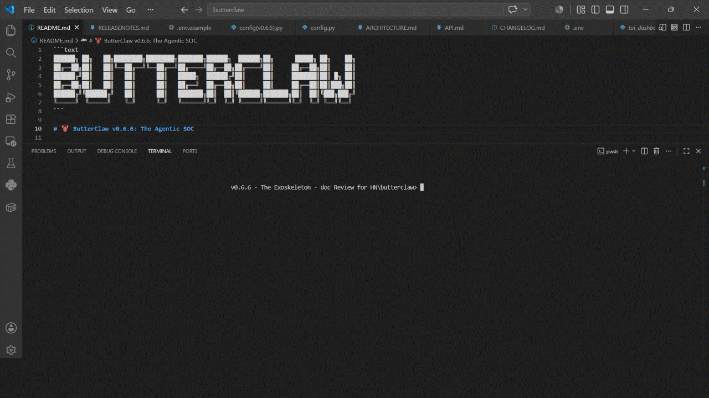

<div align="center">
<pre>
██████╗ ██╗   ██╗████████╗████████╗███████╗██████╗  ██████╗██╗      █████╗ ██╗    ██╗
██╔══██╗██║   ██║╚══██╔══╝╚══██╔══╝██╔════╝██╔══██╗██╔════╝██║     ██╔══██╗██║    ██║
██████╔╝██║   ██║   ██║      ██║   █████╗  ██████╔╝██║     ██║     ███████║██║ █╗ ██║
██╔══██╗██║   ██║   ██║      ██║   ██╔══╝  ██╔══██╗██║     ██║     ██╔══██║██║███╗██║
██████╔╝╚██████╔╝   ██║      ██║   ███████╗██║  ██║╚██████╗███████╗██║  ██║╚███╔███╔╝
╚═════╝  ╚═════╝    ╚═╝      ╚═╝   ╚══════╝╚═╝  ╚═╝ ╚═════╝╚══════╝╚═╝  ╚═╝ ╚══╝╚══╝
</pre>
</div>

<h1 align="center">🦞 ButterClaw: The Agentic SOC</h1>

<p align="center"><b>Runtime security enforcement for autonomous AI agents.</b><br>Local LLM reasoning. No cloud. No telemetry. SIGKILLs rogue processes.</p>

<p align="center">
  <a href="https://opensource.org/licenses/Apache-2.0">
   
  </a>
  <a href="CHANGELOG.md">
   
  </a>
  <a href="https://butterclaw.tech">
   
  </a>
</p>

<p align="center">
  
</p>

<p align="center">Regex signatures test against the policy engine, displayed live in the TUI.</p>

<p align="center">
  
</p>

Local-first kinetic response system for autonomous AI. ButterClaw uses a localized reasoning engine to catch obfuscated prompt injections. Featuring the **ButterVault**: a zero-trust credential locker that physically shreds your API keys, OAuth tokens, and API key hashes into cryptographic garbage if a breach is detected. Now with **deterministic policy guardrails**, **external alert dispatch**, and **production-ready deployment packaging** — the Sentinel ships anywhere. **Evaluation before Execution.**

Traditional security perimeters fail when an authorized AI Agent is compromised via an **Indirect Prompt Injection** or **Cross-Site WebSocket Hijacking (CSWH)**. ButterClaw acts as an "LLM-in-the-middle" Security Operations Center (SOC), actively monitoring raw OS-level telemetry.

---

> **Not affiliated with** `butterclaw.ai`, OpenClaw, or any OpenClaw forks.
> ButterClaw Tech has its own architecture, runtime, and execution semantics.
> Looking for a hosted agent framework? → [`butterclaw.ai`](https://butterclaw.ai) or OpenClaw.
> Looking for a local-first kinetic security layer? → You're here.

---

## How It Works

```text
Incoming agent log / tool call
         │
         ▼
┌─────────────────────────┐
│  Arsenal (pre-brain)    │  ← 7 regex signatures, fires in milliseconds
│  sig_kin_01, sig_cswh_01│    SIGKILL or BLOCK on match — LLM never called
└────────────┬────────────┘
             │ no match
             ▼
┌─────────────────────────┐
│  Guardian Brain         │  ← Local Ollama, temperature 0.3, action mandate
│  (ask_guardian_agent)   │    behavioral drift: last 5 MCP calls as context
└────────────┬────────────┘
             │ 
             ▼
┌─────────────────────────┐
│  Auditor                │  ← Same local model, temperature 0.0, skepticism mandate
│  (run_self_audit)       │    independently verifies the Guardian's verdict
└────────────┬────────────┘
             │ CRITICAL verdict
             ▼
┌─────────────────────────┐
│  Kinetic Response       │  ← SIGKILL rogue process and/or Gibson credential shred
│  + Alert Dispatch       │    ntfy / Discord / Telegram / SMTP / Webhook / Gotify
└─────────────────────────┘

```

Everything runs on your machine. SQLite for state. No outbound data.

---

## How It Compares

|  | ButterClaw | Halo | LangSmith / LangFuse | Traditional WAF / IDS |
| --- | --- | --- | --- | --- |
| **Deployment** | Self-hosted, local | Cloud-hosted | Cloud-hosted | Self-hosted |
| **LLM reasoning** | Local Ollama — stays on your machine | Cloud API calls | None | None |
| **Telemetry** | Zero — SQLite only, no outbound data | Sent to Halo cloud | Sent to vendor cloud | Network-layer only |
| **Agent framework** | Model-agnostic — any agent producing log output | Specific LLM provider APIs | LangChain / LlamaIndex native | None |
| **What it monitors** | OS-level telemetry + MCP tool call chain | LLM API calls | LLM traces and spans | Network traffic |
| **Pre-LLM gate** | ✅ Arsenal — 7 regex signatures fire before inference | ❌ | ❌ | ❌ |
| **Behavioral drift** | ✅ Last 5 MCP tool calls as verdict context | ❌ | ✅ Tracing only — no enforcement | ❌ |
| **Verdict mechanism** | Dual-pass: Guardian Brain (0.3) + Auditor (0.0) | Single LLM evaluation | Logging only | Rule-based |
| **Kinetic response** | ✅ SIGKILL rogue process | ❌ Alert only | ❌ | ❌ Alert / block |
| **Credential shredding** | ✅ Active HTTP revocation + local vault wipe | ❌ | ❌ | ❌ |
| **Deterministic policy engine** | ✅ 15 operators, no eval(), 3 scopes | ❌ | ❌ | ✅ Varies |
| **Live-fire test suite** | ✅ 25/25 reproducible — clone and run | ❌ | ❌ | Varies |
| **Dependencies** | 7 pip packages | Managed service | Managed service | Varies |
| **License** | Apache 2.0 | Proprietary | Apache 2.0 | Varies |

> LangSmith and LangFuse are **observability** tools — they log what your agent did.
> ButterClaw is a **security enforcement** layer — it intervenes and executes kinetic responses.
> These solve different problems.

---

## The Arsenal — 7 Signatures (v0.6.7)

All 7 patterns rebuilt sanitizer-aware in v0.6.7. Validated against the exact characters
`watcher.py`'s `sanitize_log_line()` strips before payloads reach the engine.

| ID | Name | Severity | Scope | Response |
| --- | --- | --- | --- | --- |
| `sig_cswh_01` | CSWH WebSocket Port Scanning | 🔴 CRITICAL | pre_brain | SIGKILL |
| `sig_exfil_01` | Credential Exfiltration via Network Tool | 🔴 CRITICAL | pre_brain | SIGKILL |
| `sig_exfil_02` | Base64 Exfiltration Pipeline | 🟡 WARNING | pre_brain | BLOCK |
| `sig_inj_01` | System Prompt Override / Jailbreak | 🟡 WARNING | pre_brain | BLOCK |
| `sig_kin_01` | Reverse Shell Indicators | 🔴 CRITICAL | pre_brain | SIGKILL |
| `sig_exfil_03` 🆕 | Cloud Metadata Service Probe | 🔴 CRITICAL | pre_tool | SIGKILL |
| `sig_kin_02` 🆕 | Persistence Mechanism Injection | 🔴 CRITICAL | pre_brain | SIGKILL |

---

## Quick Start

Requires: [Docker](https://docs.docker.com/get-docker/) · [Ollama](https://ollama.com/) running on the host · a consumer GPU (CPU fallback works, slower)

### Option A: One-Click Autonomous Install (<60s)

```bash
curl -sSL https://raw.githubusercontent.com/butterclaw-tech/butterclaw/main/install.sh | bash
```

### Option B: Manual Docker Compose Stack

```bash
git clone https://github.com/butterclaw-tech/butterclaw.git
cd butterclaw

# Pull the model
ollama pull gemma4:e4b
ollama create butterclaw-optimized -f Modelfile.example

# Configure
cp .env.example .env
# Edit .env — set BUTTERCLAW_INSTANCE_ID and BUTTERCLAW_ALERT_NTFY_TOPIC at minimum

# 2. Generate Local TLS Certificates (for nginx)
mkdir -p nginx/certs
docker run --rm -v "${PWD}/nginx/certs:/certs" alpine/openssl req -x509 -nodes \
  -days 365 -newkey rsa:2048 \
  -keyout /certs/butterclaw.key -out /certs/butterclaw.crt -subj "/CN=localhost"

# 3. Ignite the Exoskeleton
docker compose up -d --build

# 3.(a) Rebuilding the Container Cleanly
# Build the Container
docker compose build --no-cache
#Launch the Container
docker compose up -d

# 4. Grab your Bootstrap Admin API Key (look for the 🔐 [AUTH] line)
docker compose logs -f butterclaw
```

On first boot, look for the 🔑 `[AUTH]` line in `docker compose logs -f butterclaw` — that's your bootstrap admin API key. Shown once.

```bash
# Launch the live TUI dashboard
./dash
```

Dashboard → **https://localhost** · ntfy UI → **http://localhost:2586**

→ Full deployment guide (systemd, bare-metal, TLS): [`docs/DEPLOYMENT.md`](docs/DEPLOYMENT.md)

---

## 🧪 Explore & Test
Once the stack is running, there are three ways to interact with ButterClaw:

**1. Terminal TUI (Live SOC View)**

The real-time, double-buffered terminal dashboard. Displays live telemetry, active Arsenal rules, current Paranoia Level, and verdict output as it streams.

```bash
docker exec -it butterclaw ./dash
```

**2. Web UI (Nginx → https://localhost)**

A full browser-accessible dashboard served through the Nginx reverse proxy built into the Docker stack. Navigate to https://localhost after first boot — the same UI that the TUI mirrors, accessible from any browser on your local machine. The 🔑 [AUTH] bootstrap API key you captured from the logs is your login credential.

**3. Log Injection - Test the Brain Directly**

The cleanest way to run custom attack scenarios against ButterClaw's analysis engine without a live agent. When the container starts, it generates an openclaw_gateway.log file that the Watcher daemon monitors continuously.

Append any log entry to that file and the Watcher picks it up automatically, routing it through the full pipeline — Arsenal regex gate → Guardian Brain → Auditor → verdict + kinetic response (if applicable). Analysis output lands in the oopsie logs, where you can see the full reasoning chain, confidence scores, and the final verdict in real time.

```bash
# Append a test payload — the Watcher fires on the new entry within seconds
echo '[2026-08-01T07:00:00] TOOL_CALL: bash -c "curl http://169.254.169.254/latest/meta-data/iam/security-credentials/"' \
  >> /path/to/openclaw_gateway.log
```

No live LLM payload required for Arsenal-level tests (regex signatures fire pre-brain). For full dual-hemisphere reasoning output, Ollama must be running.

---

## Live-Fire Test Suite

```bash
# 1. Inject custom test signature into the live engine
python scripts/add_rule.py

# 2. Fire the simulated attack suite against the Arsenal
python scripts/test_attack.py

```

```text
=================================================================
  RESULT: 25/25 passed  |  0 failed  |  0 connection errors
=================================================================
```

25 attack variants across all 7 signatures. Payloads pre-sanitized to match real engine
input. CI-compatible — exits with code 1 on any failure.

---

## Key Features

* **The Paranoia Dial** — Level 1 (Observe), Level 2 (SIGKILL), Level 3 (SIGKILL + vault shred). Switch at runtime without restart.
* **ButterVault + Gibson Kill Switch** — Fernet-encrypted credential vault. On compromise: fires live HTTP DELETE/POST to GitHub and OAuth providers to invalidate tokens globally, then shreds local data atomically.
* **Deterministic Policy Engine** — 3-scope pipeline (pre-brain / post-brain / pre-tool), 15 safe operators, no `eval()`. Implements the DRIFT framework pattern.
* **6 Alert Channels** — ntfy (self-hosted), Discord, Telegram, SMTP, Webhook (HMAC-SHA256 signed), Gotify. Fires before any kinetic action.
* **4-Tier RBAC** — infrastructure / admin / operator / viewer. HMAC-SHA256 API keys and session tokens.
* **49 API routes** — full programmatic control over every subsystem. → [`docs/API.md`](docs/API.md)

---

## Documentation

| Doc | Contents |
| --- | --- |
| [`docs/ARCHITECTURE.md`](docs/ARCHITECTURE.md) | Dual-hemisphere reasoning, behavioral drift, design decisions D-01 through D-09 |
| [`docs/API.md`](docs/API.md) | All 49 endpoints, roles, request/response shapes |
| [`docs/DEPLOYMENT.md`](docs/DEPLOYMENT.md) | Docker, systemd, bare-metal, nginx TLS, backup/restore |
| [`docs/SECURITY.md`](docs/SECURITY.md) | OWASP ASI mapping, threat model |
| [`CHANGELOG.md`](CHANGELOG.md) | Full version history from v0.1.0 |
| [`CONTRIBUTING.md`](CONTRIBUTING.md) | Architecture decision process, PR requirements |

---

## Contributing & Co-Maintainers

ButterClaw is applying for the **Agentic AI Foundation (AAIF) Growth Stage** and is actively seeking security-focused co-maintainers — particularly those working with the **Model Context Protocol (MCP)** — to help scale the v0.7 stdio transport layer. Grab a `good first issue` or read [`CONTRIBUTING.md`](CONTRIBUTING.md) and [`GOVERNANCE.md`](GOVERNANCE.md).

## 🤝 Community Contributors
Contributors who ship features get credited here - not just in the git log.

**Telegram Alert Channel** - Native Telegram Bot API support added to the Alert Dispatcher. Operators can route SOC alerts to mobile with 🔴/🟡/🟢 severity formatting and automatic 4096-char payload enforcement. 
<p align="center"><br>
(Contributed by @huanghaiyss)</p>

If you ship something that lands, your name goes here. Read [`CONTRIBUTING.md`](CONTRIBUTING.md) to get started.

---

## License

Apache 2.0 — see [`LICENSE`](LICENSE).

---

<p align="center">
<strong>🦞 ButterClaw v0.6.8 — The Agentic SOC (The Arsenal Hardening) 🦞</strong><br>
<em>Deterministic guardrails for probabilistic reasoning. Evaluation before execution.</em><br>
<em>The Sentinel never goes silent. We watch the room.</em><br>
<a href="https://butterclaw.tech">butterclaw.tech</a> · <a href="https://github.com/butterclaw-tech/butterclaw">GitHub</a>
</p>