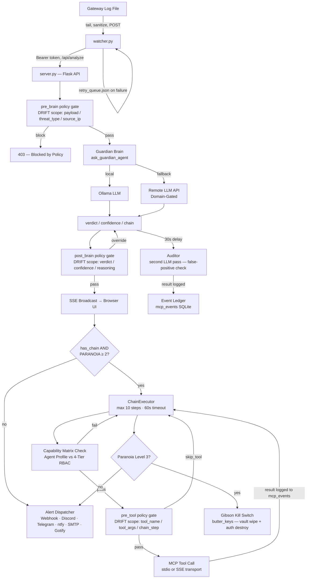

# 🏗️ ButterClaw Architecture

ButterClaw is an **LLM-in-the-middle Security Operations Center (SOC)** — a fully local, event-driven behavioral analysis pipeline for autonomous AI agents. It intercepts raw telemetry and evaluates it through multiple deterministic and probabilistic layers before allowing any kinetic execution.

---

## The Exoskeleton — Layered Defense

```text
┌─────────────────────────────────────────────────┐
│  Spatial SOC & Unified Memory Substrate (v0.8.0)│
│  4-hemisphere cognition, dual memory engine,    │
│  spatial telemetry gateway, autoresearch loop   │
├─────────────────────────────────────────────────┤
│  Deployment Layer (v0.7.2+)                     │
│  setup_wizard.py, Docker, systemd, nginx        │
├─────────────────────────────────────────────────┤
│  Physical Firewall & Capability Matrix (v0.7.0) │
│  capabilities.json, mcp_stdio_transport.json    │
├─────────────────────────────────────────────────┤
│  Alert Layer (v0.6.2)                           │
│  6 channels, 9 event types, HMAC signing        │
├─────────────────────────────────────────────────┤
│  Policy Layer (v0.6.1)                          │
│  3-scope pipeline, 15 operators, DRIFT pattern  │
├─────────────────────────────────────────────────┤
│  Auth Layer (v0.6.0)                            │
│  HMAC-SHA256 keys, 4-tier RBAC, sessions        │
├─────────────────────────────────────────────────┤
│  The Nervous System (v0.5.x)                    │
│  Brain, ChainExecutor, Event Ledger, MCP, SSE   │
├─────────────────────────────────────────────────┤
│  Core (v0.1–v0.4)                               │
│  Watcher, ButterVault, Dashboard, Ollama        │
└─────────────────────────────────────────────────┘


```

---

## High-Level Data Flow



---

## Spatial Telemetry & Memory Data Flow (v0.8.0)

A second, independent data path runs alongside the log-based flow above. It never
touches `ask_guardian_agent()` or the DRIFT policy engine — spatial verdicts are
decided entirely inside the Memory Engine, and a `BLOCK` triggers process
termination directly, without an LLM call or a Paranoia Dial check in the loop.

```mermaid
flowchart TD
    AG[AI Agent] -->|coordinates, keystrokes| GW["POST /api/spatial/telemetry\n(memory_api.py + spatial_telemetry_gateway)"]
    GW --> REG[Register agent_id / session_id\nin SQLite topology]
    REG --> EVAL[Memory Engine\nevaluate_spatial_intent]

    EVAL --> FAST{Cold Memory\nsignature match?}
    FAST -->|yes, O(1)| BLOCK[BLOCK verdict]
    FAST -->|no| SLOW[Spatial Heuristics\nkinetic velocity · spatial jitter · entropy]
    SLOW -->|threat_score ≥ 0.75| BLOCK
    SLOW -->|clean| ALLOW[ALLOW verdict]

    ALLOW --> ING[Event Ingester\nRAM queue → batched SQLite write]
    BLOCK --> ING

    BLOCK --> STORE["memory_engine.store()\nthreat_type=Spatial Telemetry"]
    STORE --> EPISODIC[(memory_episodic)]
    STORE -->|repeats 3x, same session| CRYSTAL[Live Crystallization]
    CRYSTAL --> SIGDB

    BLOCK --> TAINT[Topology Manager\napply_kinetic_taint — recursive CTE]
    TAINT -->|quarantine agent + child PIDs| WATCH[Watcher Daemon\nsuspend → kill via psutil]
    TAINT --> EVID[Preserve Evidence\nRAM disk → /data/evidence_locker]

    subgraph OFFLINE[Offline / Idle-Triggered]
        DREAMER[Dreamer Daemon\nN-gram attractor synthesis\nfrom tainted sessions] --> SIGDB[(memory_signatures)]
        ARCHIVER[Archiver Daemon\nretention + RAM sweep] --> EPISODIC
        DREAM[Dream Engine — Dream Weaver\nidle ≥ 15 min: maturation tick\n+ optional REM synthesis] --> EPISODIC
        LOOP[Loop Engine — Loop Proposer\nevery 6 hrs: replay mcp_events,\nscore, commit/revert] --> SIGDB
        LOOP -->|policy artifact type| POLDB[(policies)]
    end

    SIGDB -.->|5s TTL refresh| FAST
```

---

## Component Map

| Component | File | Role | NOT Responsible For | Failure Mode |
| --- | --- | --- | --- | --- |
| **Config** | `config.py` | Singleton env-driven configuration, 26 fields across 9 categories | Runtime decisions; validation logic | Missing required keys → `ConfigError` at boot, not at runtime |
| **Server** | `server.py` | Flask core — Guardian Brain, ChainExecutor, Auditor, SSE broadcaster. Uses SQLite WAL mode for concurrency. As of v0.8.0, also constructs and starts the Dream Engine and Loop Engine, registers `memory_api.py`'s routes, and resolves the Guardian Brain / Auditor persona preamble through `memory_engine.get_prompt_override()`. | Log ingestion; credential storage; policy authoring; memory tier storage (delegated to `memory_engine.py`) | Ollama offline → falls back to remote LLM if configured; no fallback blocks analysis |
| **Auth** | `auth.py` | HMAC-SHA256 API keys, 4-tier RBAC, HMAC-signed session tokens, rate limiting, 7 routes | Credential encryption; log ingestion; policy evaluation | Gibson destroys all key hashes + invalidates session cache simultaneously |
| **Policy Engine** | `policy_engine.py` | DRIFT policy runtime — pre_brain / post_brain / pre_tool scopes. Manages Hit Counters via non-blocking `queue.Queue` background worker. | Making trust decisions; storing credentials; LLM inference | Misconfigured allow-all rule logs only — never crashes; policy errors surface in audit log |
| **Alert Dispatcher** | `alert_dispatcher.py` | Multi-channel alert fanout bounded by a `ThreadPoolExecutor` (max 10 workers). | Determining threat severity; storing history; rate limiting per channel | Per-channel failures are independent — a broken webhook never blocks the verdict pipeline |
| **ButterVault** | `buttervault.py` | Fernet AES-128-CBC+HMAC-SHA256 encrypted credential store, OS keyring master key, Gibson | Policy evaluation; session management; alert dispatch | Master key absent from keyring → vault operations error; server degrades gracefully |
| **MCP Client** | `butterclaw_mcp.py` | MCP dual-transport abstraction — `MCPProcessManager` (stdio) + `MCPSSEClient` (remote SSE) | Tool implementation; credential management; policy decisions | MCP process crash → ChainExecutor catches per-step; chain aborts with partial results logged |
| **MCP Transport** | `mcp_transport.py` | Low-level MCP transport primitives enforcing a strict byte-level physical memory boundary on incoming payloads. | — | Payload exceeds byte limit → active pipe draining to prevent fragment poisoning |
| **Setup Wizard** | `setup_wizard.py` | Zero-dependency interactive Python configuration utility for environment bootstrapping. | Runtime execution | — |
| **Watcher** | `watcher.py` | Log tail daemon — monitors `openclaw_gateway.log`, sanitizes lines, POSTs to `/api/analyze` | Parsing log structure; interpreting semantics; auth decisions | Server offline → enqueues up to 100 entries in `retry_queue.json` (persisted on SIGTERM); singleton enforced via PID lock |
| **TUI Dashboard** | `tui_dashboard.py` | Read-only terminal operational view, launched via cross-platform harnesses (`dash.sh`, `dash.bat`). | Any write or control operations; auth enforcement | Crash does not affect server — read-only |
| **nginx** | `nginx/` | TLS termination, reverse proxy — the only internet-facing component | Auth; policy; any application logic | Trust boundary: all inbound traffic is untrusted until auth middleware in server.py accepts it |
| **Memory Engine** (v0.8.0) | `memory_engine.py` | Unified Deep (HOT/WARM/COLD episodic + semantic) and Surface (spatial telemetry, Cold Memory signatures) memory substrate. `store()`/`retrieve_context()` inject read-only recalled context into the Guardian Brain prompt; `evaluate_spatial_intent()` gates every spatial telemetry event. | Kinetic action of any kind; LLM inference; policy rule storage | `memory_signatures` table missing → Cold Memory fast-path logs and continues; deep tier is unaffected |
| **Dream Engine** (v0.8.0) | `dream_engine.py` | Idle-triggered (≥ 15 min) consolidation daemon — the "Dream Weaver" hemisphere. Runs `run_maturation_tick()` every cycle and optionally synthesizes speculative threat scenarios from the semantic graph via an injected `llm_caller`. | Any kinetic action — `DREAM_DRY_RUN=True` is a hardcoded, un-overridable constant (I-13-mem) | LLM unreachable → consolidation still runs; scenario synthesis is silently skipped, logged |
| **Loop Engine** (v0.8.0) | `loop_engine.py` | Karpathy-style autoresearch loop — the "Loop Proposer" hemisphere. Proposes one signature or policy change, replays the last N `mcp_events` through a side-effect-free shadow evaluator, scores baseline vs. candidate, commits or reverts. | Writing to `.py` files (I-15-mem, enforced at runtime via `_reject_python_targets`); auto-approving prompt changes | `policy_engine.py` import failure takes `loop_engine.py` — and `server.py`'s boot — down with it (unguarded, matching every other v0.8.0 module import) |
| **Memory API** (v0.8.0) | `memory_api.py` | 12 Flask routes for memory/dream/loop management, registered via `register_memory_routes(app, dream_engine, loop_engine)` | Any write to `policies` or `memory_signatures` outside the Loop Engine's own scoring cycle | — |
| **Event Ingester** (v0.8.0) | `event_ingester.py` | High-speed asynchronous batch writer — buffers spatial telemetry in a bounded RAM queue (max 1000), flushes to SQLite in transactions of 50 or every 0.5s | Evaluating threat — pure I/O, never blocks the gateway | Queue full → telemetry dropped, logged; never raises back to the caller |
| **Topology Manager** (v0.8.0) | `topology_manager.py` | OS-level process lineage tracking via a recursive SQLite CTE. Propagates taint down an agent's full process tree; preserves screenshot evidence from the hot RAM disk | Evaluating threat; deciding whether to kill — only executes taint/evidence steps already decided | — |
| **Watcher Daemon** (v0.8.0) | `watcher_daemon.py` | The kinetic actuator for spatial verdicts — suspends then kills a process tree via `psutil`, including OS-level children never tracked in ButterClaw's own SQLite topology (e.g. a bare `bash`/`curl` spawned outside the agent's registered PID) | Evaluating threat; identifying which PIDs to target | Orchestrator's own PID is cached at init and hardcoded-refused as a kill target, regardless of what the topology query returns |
| **Dreamer Daemon** (v0.8.0) | `dreamer_daemon.py` | Offline, always-on (2s poll) consolidation loop — distills tainted/ended session trajectories into Cold Memory attractors via sliding N-grams and terminal-cascade slicing. Distinct from `dream_engine.py`: no idle detection, no LLM call, surface-tier only. | Idle detection; LLM calls; live (same-session) crystallization | — |
| **Archiver Daemon** (v0.8.0) | `archiver_daemon.py` | Retention + RAM-disk sweeping — secures tainted-session screenshots to `/data/evidence_locker` before the 60-second volatile purge clears them, and monthly-archives + incrementally vacuums aged telemetry | — | — |
| **TUI Execution Harness** (v0.8.0) | `tui_execution_harness.py` | Pseudo-TTY wrapper that bootstraps and monitors an agent process, registering it into the SQLite topology and routing its spatial actions through the Memory Engine | — | Graceful `cleanup()` on exit or interrupt — surgically kills the orphaned child and marks the session `TERMINATED`, no zombie PIDs |

---

## Trust Boundaries & Security Model

ButterClaw operates across **seven trust zones**. Components communicate across zone boundaries only through defined, authenticated interfaces.

| Zone | Components | Trust Level | Notes |
| --- | --- | --- | --- |
| **Internet-Facing** | nginx | Untrusted | TLS termination only; all traffic treated as adversarial until validated by auth middleware |
| **Localhost / Watcher** | watcher.py → server.py | Semi-trusted (localhost only) | Watcher communicates over `127.0.0.1:5000` without per-request Bearer auth (see D-03). `/api/analyze` **must not** be exposed on external interfaces |
| **LLM Output** | Ollama / Remote LLM API response | Untrusted | Brain output is treated as untrusted data. `post_brain` policy gates are the enforcement point before any verdict-driven action is taken |
| **MCP Tools** | MCPProcessManager (stdio) / MCPSSEClient (remote) | Untrusted | Each tool call passes through a `pre_tool` policy gate and Capability Matrix check. ChainExecutor enforces step limits. |
| **Physical Transport** | mcp_transport.py | Hardware Level | Enforces strict byte-size limits and UTF-8 validation before payloads hit the JSON parser, preventing buffer poisoning. |
| **Credential Plane** | buttervault.py + OS keyring | Trusted | Master key never touches disk or environment variables. Only ButterVault and session key derivation in auth.py access the keyring |
| **Policy Plane** | policy_engine.py | Trusted | Policies are configuration, not secrets. They survive Gibson by design. No `eval()`, `exec()`, or dynamic code execution — 15 safe operators only |
| **Memory Plane** (v0.8.0) | memory_engine.py (deep tier), dream_engine.py | Trusted, read-only enrichment | Never triggers kinetic action directly — Deep Memory context is injected into the Guardian Brain prompt as enrichment only (I-12-mem). Only `sha256(raw_data)` persists; raw payloads never stored (I-10-mem). Dream Engine's `DREAM_DRY_RUN` is a hardcoded constant, not config-overridable, same pattern as Gibson's `DRY_RUN` check (I-13-mem) |
| **Spatial Telemetry Plane** (v0.8.0) | memory_engine.py (surface tier), topology_manager.py, watcher_daemon.py | Untrusted input, trusted enforcement | Raw agent coordinates/keystrokes are untrusted data. A `BLOCK` verdict from the Memory Engine authorizes Topology Manager + Watcher Daemon to act **directly** — this is a separate, faster kinetic pathway from the Paranoia-Dial-mediated one below (see Four-Hemisphere Reasoning), with no LLM call and no Paranoia Dial check in the loop |

---

## System Invariants

These are properties that must always hold. A code change that violates any invariant is a security regression regardless of test coverage.

**I-01 — Master Key Scope**
The ButterVault master key exists exclusively in the OS native keyring (`keyring.get_password`). It is never written to disk, environment variables, config files, or log output.

**I-02 — Barrier Always Encrypts**
All credentials stored in `butterclaw.db` pass through Fernet encryption before being written. The SQLite layer is untrusted — a compromised database file without the master key yields only encrypted ciphertext. Write-Ahead Logging (WAL) ensures concurrent thread safety.

**I-03 — Gibson Atomicity**
The Gibson sequence (`butter_keys`) executes as: (1) overwrite all ciphertext rows with cryptographic garbage using a new random Fernet poison key, (2) call `auth.destroy_all_api_keys()` to delete all HMAC hashes, (3) invalidate the in-memory session signing key cache. If `DRY_RUN` is set, `butter_keys()` returns immediately — this check is hardcoded and **not** config-overridable at runtime.

**I-04 — Session Signing Key Derives from Vault**
Session tokens are HMAC-signed using a key derived from the vault master key. If Gibson destroys the vault, all active sessions become cryptographically unverifiable. This is intentional — a wiped vault means no authenticated sessions should persist.

**I-05 — Allow Never Short-Circuits**
A policy rule with `action=allow` is logged but never causes the policy engine to stop evaluating subsequent rules. Only `block`, `override_critical`, `override_benign`, `skip_tool`, and `require_confidence` can short-circuit the pipeline (first non-allow match wins at lowest priority number).

**I-06 — Watcher Singleton**
Only one watcher instance may run per host, enforced by a PID lock file (`watcher.pid`). A second invocation detects the live PID and exits with an error. A stale PID file is cleaned up automatically on boot.

**I-07 — Chain Step Limit**
`ChainExecutor` executes a maximum of **10 steps** per chain with a **60-second total timeout**. No chain may grow unbounded. Each step passes through a `pre_tool` policy gate before execution.

**I-08 — Retry Queue Bounded**
The watcher retry queue is capped at **100 entries** (`deque maxlen`). Entries beyond this limit are silently dropped. Queue state is persisted to `retry_queue.json` on SIGTERM/SIGINT and reloaded on boot.

**I-09 — Sanitizer is a Targeted Blacklist**
The log line sanitizer in `watcher.py` removes only shell-dangerous characters (`[$`{}<>|;!]`). It is intentionally **not** an aggressive whitelist — preserving log structure is required for the Brain to evaluate full prompt injection attempts. Truncation limit: 4096 chars.

**I-10 — Physical STDIO Boundaries**
Unbounded string buffering is strictly prohibited in local MCP transport. All inbound pipes read via byte-level limits (`sys.stdin.buffer.readline`) to prevent Out-Of-Memory (OOM) crashes before the JSON parser engages.

---

## Memory & Cognition Invariants (v0.8.0)

These govern `memory_engine.py`, `dream_engine.py`, and `loop_engine.py` specifically.
They are numbered as a **separate series from the Core System Invariants above**
(suffixed `-mem` in this document to avoid ambiguity) because they originated in the
standalone v0.8 memory-engine design spec before that work was integrated into this
architecture doc. **I-10-mem is not I-10 above** — they refer to unrelated
properties (raw-data hashing vs. STDIO byte limits) and the numbering collision is
a known documentation quirk, not an error; do not conflate them.

**I-10-mem — No Raw Data Persists**
No code path in `memory_engine.py` ever writes raw payload content to disk. Only
`sha256(raw_data)` is stored, in both the deep tier (`memory_episodic.raw_data_hash`)
and where the surface tier recomputes a hash to count same-session repeat
occurrences for live crystallization.

**I-11-mem — Memory Survives Gibson**
`memory_episodic`, `memory_semantic`, `memory_signatures`, `dream_log`, and
`loop_experiments` all survive the Gibson sequence, by the same reasoning as
D-07 (policies survive Gibson): wiping learned behavioral memory during incident
response would leave the system with no institutional knowledge upon recovery.

**I-12-mem — Memory Context Is Read-Only**
`retrieve_context()` and `format_context_for_prompt()` inject recalled memory into
the Guardian Brain prompt as enrichment only. No code path in `memory_engine.py`
triggers kinetic action; a memory record can inform the Brain's verdict but cannot
itself cause a process termination or vault action.

**I-13-mem — REM Dreaming Is Hardcoded Dry-Run**
`dream_engine.py`'s `DREAM_DRY_RUN` is a literal Python constant (`= True`), not
read from `cfg.DRY_RUN` or any environment variable — the same hardcoded-guard
pattern as Gibson's `DRY_RUN` check (I-03). It cannot be flipped by an operator
toggling the live-traffic dry-run gate; dreaming must never be able to take a real
action, under any configuration.

**I-14-mem — Dream Cycle Yields to Live Traffic**
The Dream Engine re-checks for new `telemetry_events`/`mcp_events` activity between
every step of a consolidation/REM cycle and aborts immediately (`status="interrupted"`
in `dream_log`) if live traffic reappears — it never competes with a real request for
the database or the LLM backend.

**I-15-mem — Loop Proposer Cannot Touch Code**
`loop_engine.py` may only propose changes to three artifact types: signature
patterns (`default_signatures.json`), policy rules (the `policies` table via
`policy_engine`'s own CRUD), and prompt text (`memory_engine.prompt_overrides`,
staged only — see I-16-mem). No code path can write to a `.py` file. Enforced
twice: structurally (no "write arbitrary file" operation exists in the public API)
and at runtime (`_reject_python_targets()` raises on any `.py`-shaped target).

**I-16-mem — Prompt Overrides Are Narrow and Human-Gated**
A staged `prompt_overrides` row can only ever replace the identity/persona
**preamble** sentence of the Guardian Brain's or Auditor's system prompt — never
the mechanically-assembled paranoia-dial mode instructions, active-gate context, or
strict JSON response schema that the rest of `server.py`'s parsing logic depends on.
Writing a prompt override requires `admin` role (`POST /api/loop/prompts/<key>`);
`loop_engine.py` itself never calls `set_prompt_override()` — every prompt proposal
is forced to `status="needs_review"` regardless of `LOOP_DRY_RUN`, since there is no
deterministic replay score for prompt quality the way there is for a regex or
policy condition match.

---

## Data Flow Walkthroughs

### Flow A — Live Log → Verdict → Action (Happy Path)

1. `nginx` receives HTTPS request, terminates TLS, proxies to Flask on port 5000
2. `openclaw_gateway.log` receives a new log line from the upstream gateway
3. `watcher.py` detects the line (tail mode, 0.5s poll), strips shell-dangerous chars, truncates to 4096 chars, constructs `{threat_type: "Live Gateway Log", raw_data: <sanitized>}`
4. Watcher drains `retry_queue` first (if non-empty), then POSTs to `http://127.0.0.1:5000/api/analyze` with Bearer token
5. **Auth middleware** verifies Bearer token (API key → HMAC-SHA256 verify; or session token → HMAC verify + expiry + db check); rate limit checked per `key_id + role`
6. **pre_brain policy scope** evaluates against `{payload, threat_type, source_ip, hour_of_day, day_of_week, payload_length}`; `block` → 403 returned immediately, no LLM call made
7. **Guardian Brain** (`ask_guardian_agent`) sends prompt to Ollama (local) or remote LLM; returns `{verdict, confidence, reasoning, chain}`
8. **post_brain policy scope** evaluates; can `override_critical`, `override_benign`, or enforce `require_confidence` threshold
9. Verdict broadcast via **SSE stream** to all connected browser clients
10. If `CRITICAL` and `has_chain`: **ChainExecutor** begins; per-step: Capability Matrix → `pre_tool` gate → MCP tool call → result logged to `mcp_events` → condition evaluated → next step or abort
11. **Alert Dispatcher** fans out to all configured channels independently; channel failures do not block the pipeline
12. **Paranoia Dial check**: Level 2 → terminate offending process; Level 3 → trigger Gibson + lockdown
13. **30 seconds post-CRITICAL**: Auditor fires a second LLM pass for false-positive detection; result logged to Event Ledger

### Flow B — Gibson Sequence (Paranoia Level 3 or Manual Trigger)

1. Gibson trigger received (Level 3 verdict **or** manual `POST /api/rotate-keys` from admin)
2. `DRY_RUN` hardcoded check in `butter_keys()` — if `True`, immediate return; zero destruction occurs
3. `auth.invalidate_session_cache()` — all active sessions immediately unverifiable
4. For each provider (or all if global): generate Fernet poison key; overwrite all ciphertext in `vault` and `oauth_tokens` tables
5. `auth.destroy_all_api_keys()` — `DELETE FROM api_keys`
6. `policy_rules` and `policy_events` are **not touched** — policies survive Gibson by design
7. System is in credential-wiped state: no valid sessions, no valid API keys, vault cryptographically poisoned

### Flow C — Spatial Telemetry → Memory Verdict → Kinetic Block (v0.8.0)

This flow never calls `ask_guardian_agent()` — it is a fully separate, faster
kinetic pathway decided entirely inside the Memory Engine.

1. An AI agent's coordinates/keystrokes reach `POST /api/spatial/telemetry` (min role: `operator`)
2. The gateway registers the `agent_id`/`session_id` into the SQLite topology if not already present (`INSERT OR IGNORE`)
3. `memory_engine.evaluate_spatial_intent()` runs: **Fast Path** — check the proposed action's abstracted trajectory against the Cold Memory signature cache (O(1), refreshed every 5s); **Slow Path** (only if no signature match) — `SpatialHeuristics.evaluate_trajectory()` scores kinetic velocity, spatial jitter, and string entropy against the last 10 seconds of that session's telemetry
4. `Event Ingester` logs the attempt to a RAM queue **before** any kinetic action is taken — the incident is on the record even if the process dies mid-block
5. On `BLOCK`: the verdict is written to `memory_episodic` via `store()` (so it enters the same maturation/semantic lifecycle as every other verdict); if this exact trajectory has now recurred 3+ times within this same session, it crystallizes into a new Cold Memory signature (I-15-mem's live-crystallization path, tagged `live:` in `threat_category`)
6. `Topology Manager.apply_kinetic_taint()` propagates taint down the agent's full process tree via a recursive CTE and returns the PIDs to terminate
7. `Watcher Daemon.submit_kill_request()` suspends (freezing the process tree so it cannot fork children to evade termination), then kills each PID — including OS-level children never tracked in ButterClaw's own topology
8. `Topology Manager.preserve_evidence()` moves any screenshots for the blocked session from the volatile RAM disk to `/data/evidence_locker` before the Archiver Daemon's 60-second sweep would otherwise delete them

### Flow D — Dream Cycle (v0.8.0)

1. `dream_engine.py`'s worker thread polls every `poll_interval_seconds` (default 60s); if the system has been idle ≥ `idle_threshold_minutes` (default 15), a cycle starts
2. **Consolidation:** `memory_engine.run_maturation_tick()` recomputes `activation_strength` for every episodic record, promotes matured ones to the semantic graph, prunes stale ones, and decays low-confidence Cold Memory signatures
3. The engine re-checks for live traffic (I-14-mem); if activity reappeared since the cycle started, it aborts immediately with `status="interrupted"`
4. **REM synthesis** (only if an `llm_caller` was wired at construction): the top entities from the semantic graph are sent to the LLM asking it to imagine one plausible novel scenario combining two or more of them; the response is written to memory via `store(..., source="dream")` — never anything that resembles a real verdict (`verdict="SIMULATED"`, `confidence=0.0`)
5. The cycle's stats are logged to `dream_log`, retrievable via `GET /api/dream/log`; `POST /api/dream/trigger` (operator role) can force step 2 onward immediately, still fully subject to I-13-mem/I-14-mem

### Flow E — Loop Proposer Cycle (v0.8.0)

1. `loop_engine.py`'s worker thread fires every `cycle_interval_hours` (default 6); `POST /api/loop/trigger` (operator role) can force this immediately
2. The last `replay_window` (default 50) `tools/call` rows are loaded from `mcp_events` and converted into policy-engine-shaped evaluation contexts
3. A proposal is generated — either from an injected `llm_caller` (constrained to signature-pattern changes only) or the built-in heuristic proposer (finds the signature scoring worst against the replay window and proposes a tighter anchor)
4. The candidate is scored against the SAME replay contexts using a **side-effect-free shadow evaluator** — it reuses `policy_engine`'s own public `POLICY_OPERATORS`/`SCOPE_FIELDS`, but never mutates the live `COMPILED_SIGNATURES` list or the `policies` table while scoring; a concurrent real request is never evaluated against an untested candidate
5. `baseline_score`, `candidate_score`, and `delta_score` are recorded via `memory_engine.record_loop_experiment()`
6. **Gate:** if `LOOP_DRY_RUN` is true (the default — see I-15-mem), the experiment is recorded as `dry_run_only` and nothing changes; if false and `delta_score` clears `commit_threshold`, the change is committed directly to `default_signatures.json` or via `policy_engine.update_policy()`; prompt-type proposals are always `needs_review` regardless of `LOOP_DRY_RUN` (I-16-mem)

---

## Paranoia Dial — Response Levels

| Level | Name | Behavior | Trigger |
| --- | --- | --- | --- |
| **1** | Observe | Log + SSE broadcast + alert channels. No active response. | Default |
| **2** | Active Defense | Level 1 + terminate the offending process | CRITICAL verdict with chain + Paranoia ≥ 2 |
| **3** | Lockdown | Level 2 + Gibson (full credential wipe) + system lockdown | CRITICAL verdict with chain + Paranoia = 3, or manual trigger |

> **Note:** `DRY_RUN=true` hard-blocks Level 3 destruction. Not overridable at runtime.

> **Two independent kinetic pathways (v0.8.0):** the Paranoia Dial above governs
> process termination decided by the **Guardian Brain** — an LLM verdict, gated by
> `chain` + Paranoia level. Spatial telemetry verdicts (Flow C above) are a
> **second, entirely separate pathway**: the Memory Engine decides `BLOCK`
> directly from Cold Memory signature matches or spatial heuristics, with no LLM
> call and no Paranoia Dial check anywhere in the loop — Topology Manager and
> Watcher Daemon act immediately on that verdict. Both pathways can independently
> terminate a process; neither one gates the other.

---

## Four-Hemisphere Reasoning

ButterClaw's LLM evaluation layer is not a single model call — as of v0.7.x it was two
independent passes with opposing mandates, different temperatures, and different
system prompts (the original "dual-hemisphere" architecture: one hemisphere decisive
and action-oriented, the other skeptical and corrective). v0.8.0 adds two more,
extending the metaphor to four hemispheres — one per Guardian Brain request, one
30 seconds after every CRITICAL verdict, one on system idle, and one on a fixed
schedule:

| Hemisphere | Temp | Fires When | Mandate |
| --- | --- | --- | --- |
| Guardian Brain | `0.3` | Every request that clears `pre_brain` | Evaluate and propose action |
| Auditor | `0.0` | 30s after every CRITICAL verdict | Was I wrong? |
| Dream Weaver (v0.8.0) | `0.7` | Idle ≥ 15 min | What haven't I seen? |
| Loop Proposer (v0.8.0) | `0.4` | Every 6 hours | How can I get better? |

### Hemisphere 1 — The Guardian Brain (`ask_guardian_agent()`)

**Mandate:** Evaluate the current event and decide whether to act.
**Temperature:** `0.3` — low, to produce consistent, structured JSON verdicts.
**Fires:** On every payload that clears the `pre_brain` policy gate.

The Guardian Brain receives:

* The current threat type and raw log payload
* A sliding window of recent agent actions as `timeline_context` (see Behavioral Drift Tracking below)
* The current Paranoia level, which modifies the system prompt instructions
* The list of available MCP tools and their descriptions
* A strict JSON output schema: `{verdict, confidence, primary_gate, reasoning, chain?}`

The Brain produces a verdict (`CRITICAL` / `WARNING` / `BENIGN`) and, for CRITICAL events,
an optional `chain` array of MCP tool steps for the ChainExecutor to execute. It does
**not** execute anything directly — it proposes; the policy engine and Paranoia Dial
decide whether to act.

### Hemisphere 2 — The Auditor (`run_self_audit()`)

**Mandate:** Determine whether the Guardian Brain overreacted.
**Temperature:** `0.0` — deterministic, to produce stable false-positive assessments.
**Fires:** 30 seconds after every `CRITICAL` verdict, in a background daemon thread.

The Auditor receives:

* The same sliding window of recent MCP actions (now including any actions taken in response to the CRITICAL verdict)
* The original threat that triggered the CRITICAL verdict
* A system prompt with a single goal: `audit_verdict: AGREEMENT | FALSE_POSITIVE`

If the Auditor returns `FALSE_POSITIVE`, the event is flagged in the Event Ledger and
the TUI Dashboard with an amber 🤔 indicator. No automatic reversal of kinetic actions
occurs — the Auditor is a diagnostic instrument, not an undo mechanism. Reversing a
Gibson sequence is a deliberate operator decision, not an automated one.

### Hemisphere 3 — The Dream Weaver (`dream_engine.py`, v0.8.0)

**Mandate:** Consolidate what's been learned, and imagine what hasn't been seen yet.
**Temperature:** `0.7` — the only hemisphere run warm, since scenario synthesis
benefits from creative recombination rather than deterministic output.
**Fires:** After the system has been idle ≥ 15 minutes (default), or on-demand via
`POST /api/dream/trigger`.

The Dream Weaver's cycle has two parts. First, unconditionally: `run_maturation_tick()`
ages every episodic record's `activation_strength`, promotes matured ones into the
semantic graph, prunes stale ones, and decays low-confidence Cold Memory signatures —
consolidation work that exists independently of any LLM call. Second, only if an
`llm_caller` is wired: it samples the most-observed entities from the semantic graph
and asks the model to imagine one plausible novel attack scenario combining two or
more of them — patterns the system has learned individually but never seen chained
together. The result is written to memory as `source="dream"`, `verdict="SIMULATED"`,
surfacing as a `[DREAM-PRIMED]` tag when later recalled into the Guardian Brain's
context (I-12-mem: read-only enrichment, never a real verdict).

### Hemisphere 4 — The Loop Proposer (`loop_engine.py`, v0.8.0)

**Mandate:** Look at what's actually happened, and propose one concrete improvement.
**Temperature:** `0.4` — moderate; consistent enough to produce a single well-formed
proposal, warm enough to consider more than the most obvious fix.
**Fires:** Every 6 hours (default), or on-demand via `POST /api/loop/trigger`.

Adapted from Karpathy's autoresearch loop (`read → edit code → train 5min → eval →
keep/revert`) with the "training" step replaced by a pure evaluation pass over the
system's own history: `snapshot baseline_score → propose one signature or policy
change → replay the last 50 mcp_events → compare scores → dry-run gate → commit or
revert`. No model weights are ever touched — the eval corpus **is** the event ledger.
Unlike the Dream Weaver's hardcoded dry-run, the Loop Proposer's dry-run
(`LOOP_DRY_RUN`) is meant to be flipped once an operator trusts its proposal quality
(see I-15-mem/I-16-mem for what it is permanently barred from touching regardless).

### Why Four Calls, Not One

A single LLM call cannot simultaneously optimize for decisive action, skeptical
review, speculative imagination, and self-improvement — these are four different,
often opposing, prompt pressures. Combining any two of them into one call typically
produces hedged, low-confidence output that underperforms at every task it's asked to
do at once. Separating them into four calls — each with an explicit mandate, its own
temperature, and its own trigger condition (per-request, post-verdict, idle, and
scheduled) — lets each hemisphere operate at its natural optimum instead of
compromising for the others.

---

## Behavioral Drift Tracking

Behavioral drift tracking is the mechanism by which ButterClaw evaluates a new event
**in the context of what the agent has done recently**, rather than treating each event
in isolation.

### Implementation

On every call to `ask_guardian_agent()` and `run_self_audit()`, the server queries the
Event Ledger for the 5 most recent successful MCP tool calls. These events are formatted into a `timeline_context` string and prepended to the user prompt sent to both LLM hemispheres. The model uses this window to answer the implicit question: *does the current event represent a departure from this agent's recent behavioral pattern?*

> **Note (v0.8.0):** the Loop Proposer also reads `mcp_events`, but for a
> fundamentally different purpose — not as live per-request context prepended to a
> prompt, but as a **replay corpus** for scoring a proposed signature/policy change
> after the fact (up to the last 50 `tools/call` rows, default). It never sees a
> `timeline_context` string and never influences a live Guardian Brain or Auditor
> verdict; it only evaluates whether a candidate change would have scored better or
> worse against history.

---

## Source Code Map

| File / Directory | Approx. Lines | Owns | Key Entry Points |
| --- | --- | --- | --- |
| `server.py` | ~1,800 | Flask core — Guardian Brain, Auditor, ChainExecutor, SSE broadcaster, 30 routes | `ask_guardian_agent()`, `run_self_audit()`, `ChainExecutor.run()`, `/api/analyze` |
| `policy_engine.py` | ~900 | DRIFT policy runtime, rule CRUD, 3-scope evaluators, `policy_events` audit log | `evaluate_policy(scope, context)`, `test_payload()` |
| `buttervault.py` | ~700 | Fernet vault, OS keyring master key, Gibson, OAuth token lifecycle | `store_key()`, `retrieve_key()`, `butter_keys()`, `refresh_oauth_token()` |
| `auth.py` | ~650 | HMAC-SHA256 API keys, 4-tier RBAC, HMAC-signed sessions, rate limiter, 7 routes | `verify_api_key()`, `require_auth()`, `destroy_all_api_keys()`, `ROUTE_CLASSIFICATION` |
| `alert_dispatcher.py` | ~300 | Multi-channel alert fanout (6 channels, 9 event types), 13 routes | `dispatch_alert(verdict, context)` |
| `butterclaw_mcp.py` | ~400 | MCP dual-transport, `BaseMCPManager` interface | `MCPProcessManager`, `MCPSSEClient`, `get_available_tools()`, `call_tool()` |
| `mcp_transport.py` | ~200 | Low-level MCP transport primitives | — |
| `watcher.py` | ~250 | Log tail, blacklist sanitizer, retry queue, PID lock, log rotation detection | `watch_log()`, `send_to_server()`, `main()` |
| `setup_wizard.py` | ~400 | Environment bootstrap | `main()` |
| `oauth_config.py` | ~150 | OAuth provider registry (GitHub + generic), token revocation logic | `get_provider_config()` |
| `config.py` | ~300 | Singleton config loader, `cfg` object, 26 fields / 9 categories | `cfg` (singleton), `ConfigError` |
| `tui_dashboard.py` | ~350 | Read-only TUI operational view | `main()` |
| `memory_engine.py` (v0.8.0) | ~1,900 | Unified Deep + Surface memory substrate — HOT/WARM/COLD tiers, activation maturation, spatial telemetry, Cold Memory signatures, `loop_experiments`/`prompt_overrides` tables | `store()`, `retrieve_context()`, `reconsolidate()`, `run_maturation_tick()`, `evaluate_spatial_intent()`, `ingest_telemetry_event()` |
| `dream_engine.py` (v0.8.0) | ~450 | Idle-triggered consolidation + REM scenario synthesis — the Dream Weaver hemisphere | `DreamEngine.start()`, `.trigger_now()`, `._run_dream_cycle()` |
| `loop_engine.py` (v0.8.0) | ~720 | Karpathy-style autoresearch loop — the Loop Proposer hemisphere | `LoopEngine.run_cycle()`, `SignatureArtifactAdapter`, `PolicyArtifactAdapter`, `PromptArtifactAdapter` |
| `memory_api.py` (v0.8.0) | ~230 | 12 Flask routes for memory/dream/loop management | `register_memory_routes(app, dream_engine, loop_engine)` |
| `event_ingester.py` (v0.8.0) | ~110 | High-speed async batch writer for spatial telemetry | `EventIngester.log_event()` |
| `topology_manager.py` (v0.8.0) | ~110 | Process lineage tracking, taint propagation, evidence preservation | `TopologyManager.apply_kinetic_taint()`, `.preserve_evidence()` |
| `watcher_daemon.py` (v0.8.0) | ~125 | Kinetic actuator — suspends and kills process trees via `psutil` | `WatcherDaemon.submit_kill_request()` |
| `dreamer_daemon.py` (v0.8.0) | ~150 | Offline N-gram Cold Memory signature synthesis from tainted sessions | `DreamerConsolidationLoop.start_dreaming()` |
| `archiver_daemon.py` (v0.8.0) | ~170 | Retention, RAM-disk sweeping, evidence securing | `ArchiverDaemon.start_archiving()` |
| `tui_execution_harness.py` (v0.8.0) | ~215 | Pseudo-TTY agent bootstrap + spatial channel interception | `TUIExecutionHarness.bootstrap_agent()`, `.intercept_spatial_channel()` |
| `capabilities.json` | — | Positive Security Model matrix defining agent profiles | Loaded by `policy_engine.py` |
| `default_signatures.json` | — | Threat Signature Arsenal — regex patterns for `pre_brain` signature scan | Loaded by `policy_engine.py` at startup |
| `nginx/` | — | TLS proxy — the internet-facing trust boundary | `nginx.conf` |
| `systemd/` | — | Service unit files | `butterclaw.service`, `watcher.service` |
| `scripts/` | — | Diagnostics and live-fire test scripts | `test_attack.py`, `test_mcp.py`, `add_rule.py` |

---

## DRIFT Policy Engine — Scope Reference

| Scope | When | Available Context Fields | Valid Actions |
| --- | --- | --- | --- |
| `pre_brain` | Before LLM call | `payload`, `threat_type`, `payload_length`, `source_ip`, `hour_of_day`, `day_of_week` | `allow`, `block` |
| `post_brain` | After LLM verdict | All `pre_brain` fields + `verdict`, `confidence`, `primary_gate`, `reasoning`, `has_chain` | `allow`, `block`, `override_critical`, `override_benign`, `require_confidence` |
| `pre_tool` | Before each MCP tool call | All prior fields + `tool_name`, `tool_args`, `chain_step` | `allow`, `block`, `skip_tool` |

**15 safe operators** (no `eval()`/`exec()`): `contains`, `not_contains`, `equals`, `not_equals`, `starts_with`, `ends_with`, `regex_match`, `greater_than`, `less_than`, `greater_equal`, `less_equal`, `in_list`, `not_in_list`, `length_gt`, `length_lt`

---

## Design Decisions

**D-01 — HMAC-SHA256 API keys, not JWT**
Zero new pip dependencies — stdlib `hmac`, `hashlib`, `secrets` only. JWTs add ecosystem complexity not justified for a single-server deployment model.

**D-02 — Policy engine uses no `eval()`**
15 safe operators using stdlib only. Policies are configuration, not code — this is an explicit trust boundary.

**D-03 — Watcher → Server is unauthenticated on localhost**
Intentional design tradeoff: watcher and server are co-located. Adding mutual auth would require the watcher to hold credentials, introducing management complexity this architecture avoids. `/api/analyze` **must not** be exposed on external interfaces.

**D-04 — `allow` policy action never short-circuits**
Prevents policy authors from accidentally suppressing subsequent block rules with a blanket allow.

**D-05 — Master key in OS keyring, never on disk**
A backup of `butterclaw.db` without the keyring entry is useless to an attacker.

**D-06 — Sanitizer is a targeted blacklist**
An allowlist would corrupt log entries and reduce the Brain's ability to analyze full prompt injection payloads. Log lines are data, not executed code.

**D-07 — Policies survive Gibson**
Wiping policies during incident response would leave the system defenseless upon recovery. Credential wipe + policy preservation allows immediate re-authentication and continued enforcement.

**D-08 — Two LLM Calls Instead of One (Dual-Hemisphere Architecture)**
A single prompt cannot simultaneously optimize for decisive threat response and skeptical false-positive review — combining these goals produces hedged output that underperforms at both. *(v0.8.0 extended this same reasoning to a third and fourth hemisphere — Dream Weaver and Loop Proposer — each with its own mandate and trigger condition rather than folding more goals into the original two; see Four-Hemisphere Reasoning above.)*

**D-09 — Drift Window is 5 Events, Success-Only**
Five events is sufficient to reveal a multi-step attack sequence without flooding the prompt context window with noise.

**D-10 — Python Bootstrapping Over Bash Pipeline**
The legacy `install.sh` bash pipeline was entirely replaced by `setup_wizard.py` to prevent Git tree conflicts and OS-specific deployment failures across Windows, Docker, and Baremetal systems.

**D-11 — Domain-Gated Remote LLM Keys**
To prevent credential exfiltration to untrusted endpoints, Google API keys are hard-gated in `server.py` and strictly attached only when communicating with `generativelanguage.googleapis.com`.

**D-12 — Physical STDIO Firewall**
Replaced unbounded string buffering with raw byte-level reads to enforce a hard physical memory boundary on incoming payloads. This prevents Out-Of-Memory (OOM) crashes before the JSON parser ever engages.

**D-13 — One Merged Memory Engine, Not Two (v0.8.0)**
Two independent v0.8 memory-engine designs existed in parallel: a Copilot-authored Deep Memory Engine (episodic/semantic consolidation) and a Gemini-authored Surface Memory Engine (spatial telemetry/signatures). Rather than choosing one, they were merged into a single `memory_engine.py` — the deep tier had no notion of raw telemetry, and the surface tier had no persistence beyond its signature cache and assumed tables (`telemetry_events`, `memory_signatures`) that didn't yet exist anywhere in the codebase. Merging let telemetry flow into the same episodic/semantic lifecycle as every other verdict, rather than maintaining two disconnected memory substrates.

**D-14 — Canonical Schema Wins, Even Retroactively**
When the merged memory engine's `memory_signatures` schema (`signature_id`/`hit_count`/...) turned out to differ from the schema `server.py`'s `init_db()` and `dreamer_daemon.py` had already committed to (`sig_id`/`behavioral_hash`/`confidence_score`/`discovered_at`), the memory engine was rebuilt to match the schema already in use, not the other way around — because `server.py` initializes the database first, its schema silently wins any `CREATE TABLE IF NOT EXISTS` race regardless of which was "more correct" in isolation.

**D-15 — Live Crystallization Is Scoped to One Session**
Zero-day heuristic hits are only crystallized into a permanent Cold Memory signature after 3+ repeats **within the same session** — never counted across unrelated sessions. Three different users independently tripping the same overzealous heuristic is treated as three coincidences, not one confirmed attack pattern; only sustained repetition from a single source earns a permanent, O(1)-fast-pathed blacklist entry.

**D-16 — Two Different Dry-Run Postures, By Design**
`dream_engine.py`'s `DREAM_DRY_RUN` is a hardcoded Python constant — dreaming must never take a real action, full stop, matching Gibson's `DRY_RUN` pattern (I-03). `loop_engine.py`'s `LOOP_DRY_RUN` is deliberately configurable (env-driven, defaults true) — the Loop Proposer's proposals are explicitly meant to go live once an operator trusts the proposal quality, per the original v0.8 design intent. The two safety postures look similar but encode different intentions and must not be unified into one pattern.

**D-17 — Shadow Evaluation, Never Live Mutation, for Scoring**
`loop_engine.py` scores a candidate signature/policy change using its own isolated evaluator (reusing `policy_engine`'s public `POLICY_OPERATORS`/`SCOPE_FIELDS` matching primitives) rather than temporarily swapping the live `COMPILED_SIGNATURES` list or writing a candidate into the live `policies` table and reverting. A real concurrent request must never be evaluated against an untested hypothesis, even for the fraction of a second a scoring pass would take.

**D-18 — Prompt Overrides Cover Persona Only, Never the Contract**
A staged `prompt_overrides` row can only replace the identity/persona preamble sentence of the Guardian Brain's or Auditor's system prompt. The paranoia-dial mode instructions, active-gate context, and strict JSON response schema remain hardcoded and unconditional — an admin-approved-but-careless prompt change must never be able to silently break `server.py`'s response parsing or drop a safety instruction.

**D-19 — `register_X_routes(app)` Over Flask Blueprints**
`memory_api.py` follows the same `register_memory_routes(app)` pattern `auth.py` established (a plain function taking the live Flask `app` object), rather than introducing Flask's `Blueprint` object as a one-off pattern not used anywhere else in the codebase — despite the original v0.8 design notes calling for "Blueprint routes." Functionally equivalent; consistent with what's already here.

---

## Extension Points

| Extension | Interface | Notes |
| --- | --- | --- |
| **LLM Backend** | `ask_guardian_agent()` in `server.py` | Swap between local Ollama and any OpenAI-compatible remote API via `butterclaw.yml` |
| **MCP Transport** | `BaseMCPManager` in `butterclaw_mcp.py` | Subclass for custom transports |
| **Alert Channels** | Channel config in `alert_dispatcher.py` | 6 built-in types; extend the channel dispatcher |
| **Policy Operators** | Operator registry in `policy_engine.py` | Add to dispatch table — no `eval()`, must be an explicit handler |
| **Signature Patterns** | `default_signatures.json` | Requires restart to recompile |
| **RBAC Roles** | `ROLE_HIERARCHY` in `auth.py` | `infrastructure` is machine-to-machine only — do not issue to human operators |
| **Prompt Personas** (v0.8.0) | `prompt_overrides` table via `POST /api/loop/prompts/<key>` | Only the identity/persona preamble is swappable per hemisphere (`guardian_brain_preamble`, `auditor_preamble`); the operational scaffolding around it is not — see D-18 |
| **Loop Artifact Types** (v0.8.0) | `SignatureArtifactAdapter` / `PolicyArtifactAdapter` / `PromptArtifactAdapter` in `loop_engine.py` | Adding a fourth artifact type means adding a new adapter with its own `score()`/`commit()` — never bypass `_reject_python_targets()` (I-15-mem) |
| **Dream Scenario Synthesis** (v0.8.0) | `llm_caller` callback injected into `DreamEngine` | Swap the model/prompt used for REM synthesis without touching `dream_engine.py`'s consolidation logic |
| **Memory Tiers** (v0.8.0) | `memory_engine.py`'s `_SCHEMA` + tier-specific helper functions | A fourth tier would need its own `CREATE TABLE IF NOT EXISTS` (idempotent, matches existing pattern) and its own `store()`/`retrieve` pair — the existing tiers never assume there are exactly three |

---

## Related Documentation

* [`API.md`](API.md) — Full endpoint reference (63 routes, 4-tier RBAC)
* [`SECURITY.md`](SECURITY.md) — Threat model, attack surfaces, responsible disclosure
* [`DEPLOYMENT.md`](DEPLOYMENT.md) — Docker, systemd, nginx, backup configuration
