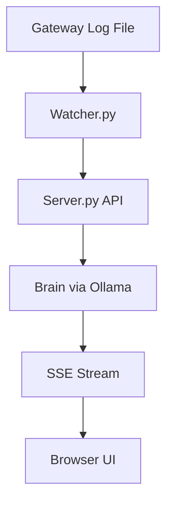

# 🏗️ ButterClaw Architecture

ButterClaw is designed as an "LLM-in-the-middle" Security Operations Center (SOC). It intercepts raw telemetry and evaluates it through multiple deterministic and probabilistic layers before allowing any kinetic execution.

# Architecture Overview

Project is a fully local, event-driven behavioral analysis pipeline for autonomous AI agents.

## The Exoskeleton — Layered Defense

```text
┌─────────────────────────────────────────────────┐
│  Deployment Layer (v0.6.3+)                     │
│  Docker, systemd, nginx, config.py, backup      │
├─────────────────────────────────────────────────┤
│  Alert Layer (v0.6.2)                           │
│  5 channels, 9 event types, HMAC signing        │
├─────────────────────────────────────────────────┤
│  Policy Layer (v0.6.1)                          │
│  3-scope pipeline, 16 operators, DRIFT pattern  │
├─────────────────────────────────────────────────┤
│  Auth Layer (v0.6.0)                            │
│  HMAC-SHA256 keys, 3-tier RBAC, sessions        │
├─────────────────────────────────────────────────┤
│  The Nervous System (v0.5.x)                    │
│  Brain, ChainExecutor, Event Ledger, MCP, SSE   │
├─────────────────────────────────────────────────┤
│  Core (v0.1–v0.4)                               │
│  Watcher, ButterVault, Dashboard, Ollama        │
└─────────────────────────────────────────────────┘
```

## High-Level Diagram



## Component Map

| Component | File | Role |
|---|---|---|
| **Config** | `config.py` | Centralized env-driven configuration |
| **Server** | `server.py` | Flask API, Brain reasoning loop, ChainExecutor |
| **Auth** | `auth.py` | API gateway, RBAC, session tokens |
| **Policy Engine** | `policy_engine.py` | Deterministic guardrails (pre-brain/post-brain) |
| **Alert Dispatcher** | `alert_dispatcher.py` | Push notifications & webhooks |
| **ButterVault** | `buttervault.py` | Encrypted vault, active revokes, Gibson Kill Switch |
| **MCP Client** | `butterclaw_mcp.py` | Tool definitions & SSRF blocks |
| **MCP Transport** | `mcp_transport.py` | SSE/stdio transport layer |
| **OAuth Config** | `oauth_config.py` | OAuth provider templates |
| **Watcher** | `watcher.py` | OS telemetry collector |