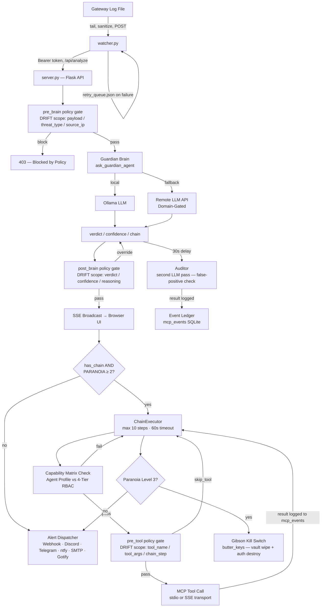

# 🏗️ ButterClaw Architecture

ButterClaw is an **LLM-in-the-middle Security Operations Center (SOC)** — a fully local, event-driven behavioral analysis pipeline for autonomous AI agents. It intercepts raw telemetry and evaluates it through multiple deterministic and probabilistic layers before allowing any kinetic execution.

---

## The Exoskeleton — Layered Defense

```text
┌─────────────────────────────────────────────────┐
│  Deployment Layer (v0.7.2+)                     │
│  setup_wizard.py, Docker, systemd, nginx        │
├─────────────────────────────────────────────────┤
│  Physical Firewall & Capability Matrix (v0.7.0) │
│  capabilities.json, mcp_stdio_transport.json    │
├─────────────────────────────────────────────────┤
│  Alert Layer (v0.6.2)                           │
│  6 channels, 9 event types, HMAC signing        │
├─────────────────────────────────────────────────┤
│  Policy Layer (v0.6.1)                          │
│  3-scope pipeline, 15 operators, DRIFT pattern  │
├─────────────────────────────────────────────────┤
│  Auth Layer (v0.6.0)                            │
│  HMAC-SHA256 keys, 4-tier RBAC, sessions        │
├─────────────────────────────────────────────────┤
│  The Nervous System (v0.5.x)                    │
│  Brain, ChainExecutor, Event Ledger, MCP, SSE   │
├─────────────────────────────────────────────────┤
│  Core (v0.1–v0.4)                               │
│  Watcher, ButterVault, Dashboard, Ollama        │
└─────────────────────────────────────────────────┘


```

---

## High-Level Data Flow



---

## Component Map

| Component | File | Role | NOT Responsible For | Failure Mode |
| --- | --- | --- | --- | --- |
| **Config** | `config.py` | Singleton env-driven configuration, 26 fields across 9 categories | Runtime decisions; validation logic | Missing required keys → `ConfigError` at boot, not at runtime |
| **Server** | `server.py` | Flask core — Guardian Brain, ChainExecutor, Auditor, SSE broadcaster, 30 routes. Uses SQLite WAL mode for concurrency. | Log ingestion; credential storage; policy authoring | Ollama offline → falls back to remote LLM if configured; no fallback blocks analysis |
| **Auth** | `auth.py` | HMAC-SHA256 API keys, 4-tier RBAC, HMAC-signed session tokens, rate limiting, 7 routes | Credential encryption; log ingestion; policy evaluation | Gibson destroys all key hashes + invalidates session cache simultaneously |
| **Policy Engine** | `policy_engine.py` | DRIFT policy runtime — pre_brain / post_brain / pre_tool scopes. Manages Hit Counters via non-blocking `queue.Queue` background worker. | Making trust decisions; storing credentials; LLM inference | Misconfigured allow-all rule logs only — never crashes; policy errors surface in audit log |
| **Alert Dispatcher** | `alert_dispatcher.py` | Multi-channel alert fanout bounded by a `ThreadPoolExecutor` (max 10 workers). | Determining threat severity; storing history; rate limiting per channel | Per-channel failures are independent — a broken webhook never blocks the verdict pipeline |
| **ButterVault** | `buttervault.py` | Fernet AES-128-CBC+HMAC-SHA256 encrypted credential store, OS keyring master key, Gibson | Policy evaluation; session management; alert dispatch | Master key absent from keyring → vault operations error; server degrades gracefully |
| **MCP Client** | `butterclaw_mcp.py` | MCP dual-transport abstraction — `MCPProcessManager` (stdio) + `MCPSSEClient` (remote SSE) | Tool implementation; credential management; policy decisions | MCP process crash → ChainExecutor catches per-step; chain aborts with partial results logged |
| **MCP Transport** | `mcp_transport.py` | Low-level MCP transport primitives enforcing a strict byte-level physical memory boundary on incoming payloads. | — | Payload exceeds byte limit → active pipe draining to prevent fragment poisoning |
| **Setup Wizard** | `setup_wizard.py` | Zero-dependency interactive Python configuration utility for environment bootstrapping. | Runtime execution | — |
| **Watcher** | `watcher.py` | Log tail daemon — monitors `openclaw_gateway.log`, sanitizes lines, POSTs to `/api/analyze` | Parsing log structure; interpreting semantics; auth decisions | Server offline → enqueues up to 100 entries in `retry_queue.json` (persisted on SIGTERM); singleton enforced via PID lock |
| **TUI Dashboard** | `tui_dashboard.py` | Read-only terminal operational view, launched via cross-platform harnesses (`dash.sh`, `dash.bat`). | Any write or control operations; auth enforcement | Crash does not affect server — read-only |
| **nginx** | `nginx/` | TLS termination, reverse proxy — the only internet-facing component | Auth; policy; any application logic | Trust boundary: all inbound traffic is untrusted until auth middleware in server.py accepts it |

---

## Trust Boundaries & Security Model

ButterClaw operates across **seven trust zones**. Components communicate across zone boundaries only through defined, authenticated interfaces.

| Zone | Components | Trust Level | Notes |
| --- | --- | --- | --- |
| **Internet-Facing** | nginx | Untrusted | TLS termination only; all traffic treated as adversarial until validated by auth middleware |
| **Localhost / Watcher** | watcher.py → server.py | Semi-trusted (localhost only) | Watcher communicates over `127.0.0.1:5000` without per-request Bearer auth (see D-03). `/api/analyze` **must not** be exposed on external interfaces |
| **LLM Output** | Ollama / Remote LLM API response | Untrusted | Brain output is treated as untrusted data. `post_brain` policy gates are the enforcement point before any verdict-driven action is taken |
| **MCP Tools** | MCPProcessManager (stdio) / MCPSSEClient (remote) | Untrusted | Each tool call passes through a `pre_tool` policy gate and Capability Matrix check. ChainExecutor enforces step limits. |
| **Physical Transport** | mcp_transport.py | Hardware Level | Enforces strict byte-size limits and UTF-8 validation before payloads hit the JSON parser, preventing buffer poisoning. |
| **Credential Plane** | buttervault.py + OS keyring | Trusted | Master key never touches disk or environment variables. Only ButterVault and session key derivation in auth.py access the keyring |
| **Policy Plane** | policy_engine.py | Trusted | Policies are configuration, not secrets. They survive Gibson by design. No `eval()`, `exec()`, or dynamic code execution — 15 safe operators only |

---

## System Invariants

These are properties that must always hold. A code change that violates any invariant is a security regression regardless of test coverage.

**I-01 — Master Key Scope**
The ButterVault master key exists exclusively in the OS native keyring (`keyring.get_password`). It is never written to disk, environment variables, config files, or log output.

**I-02 — Barrier Always Encrypts**
All credentials stored in `butterclaw.db` pass through Fernet encryption before being written. The SQLite layer is untrusted — a compromised database file without the master key yields only encrypted ciphertext. Write-Ahead Logging (WAL) ensures concurrent thread safety.

**I-03 — Gibson Atomicity**
The Gibson sequence (`butter_keys`) executes as: (1) overwrite all ciphertext rows with cryptographic garbage using a new random Fernet poison key, (2) call `auth.destroy_all_api_keys()` to delete all HMAC hashes, (3) invalidate the in-memory session signing key cache. If `DRY_RUN` is set, `butter_keys()` returns immediately — this check is hardcoded and **not** config-overridable at runtime.

**I-04 — Session Signing Key Derives from Vault**
Session tokens are HMAC-signed using a key derived from the vault master key. If Gibson destroys the vault, all active sessions become cryptographically unverifiable. This is intentional — a wiped vault means no authenticated sessions should persist.

**I-05 — Allow Never Short-Circuits**
A policy rule with `action=allow` is logged but never causes the policy engine to stop evaluating subsequent rules. Only `block`, `override_critical`, `override_benign`, `skip_tool`, and `require_confidence` can short-circuit the pipeline (first non-allow match wins at lowest priority number).

**I-06 — Watcher Singleton**
Only one watcher instance may run per host, enforced by a PID lock file (`watcher.pid`). A second invocation detects the live PID and exits with an error. A stale PID file is cleaned up automatically on boot.

**I-07 — Chain Step Limit**
`ChainExecutor` executes a maximum of **10 steps** per chain with a **60-second total timeout**. No chain may grow unbounded. Each step passes through a `pre_tool` policy gate before execution.

**I-08 — Retry Queue Bounded**
The watcher retry queue is capped at **100 entries** (`deque maxlen`). Entries beyond this limit are silently dropped. Queue state is persisted to `retry_queue.json` on SIGTERM/SIGINT and reloaded on boot.

**I-09 — Sanitizer is a Targeted Blacklist**
The log line sanitizer in `watcher.py` removes only shell-dangerous characters (`[$`{}<>|;!]`). It is intentionally **not** an aggressive whitelist — preserving log structure is required for the Brain to evaluate full prompt injection attempts. Truncation limit: 4096 chars.

**I-10 — Physical STDIO Boundaries**
Unbounded string buffering is strictly prohibited in local MCP transport. All inbound pipes read via byte-level limits (`sys.stdin.buffer.readline`) to prevent Out-Of-Memory (OOM) crashes before the JSON parser engages.

---

## Data Flow Walkthroughs

### Flow A — Live Log → Verdict → Action (Happy Path)

1. `nginx` receives HTTPS request, terminates TLS, proxies to Flask on port 5000
2. `openclaw_gateway.log` receives a new log line from the upstream gateway
3. `watcher.py` detects the line (tail mode, 0.5s poll), strips shell-dangerous chars, truncates to 4096 chars, constructs `{threat_type: "Live Gateway Log", raw_data: <sanitized>}`
4. Watcher drains `retry_queue` first (if non-empty), then POSTs to `http://127.0.0.1:5000/api/analyze` with Bearer token
5. **Auth middleware** verifies Bearer token (API key → HMAC-SHA256 verify; or session token → HMAC verify + expiry + db check); rate limit checked per `key_id + role`
6. **pre_brain policy scope** evaluates against `{payload, threat_type, source_ip, hour_of_day, day_of_week, payload_length}`; `block` → 403 returned immediately, no LLM call made
7. **Guardian Brain** (`ask_guardian_agent`) sends prompt to Ollama (local) or remote LLM; returns `{verdict, confidence, reasoning, chain}`
8. **post_brain policy scope** evaluates; can `override_critical`, `override_benign`, or enforce `require_confidence` threshold
9. Verdict broadcast via **SSE stream** to all connected browser clients
10. If `CRITICAL` and `has_chain`: **ChainExecutor** begins; per-step: Capability Matrix → `pre_tool` gate → MCP tool call → result logged to `mcp_events` → condition evaluated → next step or abort
11. **Alert Dispatcher** fans out to all configured channels independently; channel failures do not block the pipeline
12. **Paranoia Dial check**: Level 2 → terminate offending process; Level 3 → trigger Gibson + lockdown
13. **30 seconds post-CRITICAL**: Auditor fires a second LLM pass for false-positive detection; result logged to Event Ledger

### Flow B — Gibson Sequence (Paranoia Level 3 or Manual Trigger)

1. Gibson trigger received (Level 3 verdict **or** manual `POST /api/rotate-keys` from admin)
2. `DRY_RUN` hardcoded check in `butter_keys()` — if `True`, immediate return; zero destruction occurs
3. `auth.invalidate_session_cache()` — all active sessions immediately unverifiable
4. For each provider (or all if global): generate Fernet poison key; overwrite all ciphertext in `vault` and `oauth_tokens` tables
5. `auth.destroy_all_api_keys()` — `DELETE FROM api_keys`
6. `policy_rules` and `policy_events` are **not touched** — policies survive Gibson by design
7. System is in credential-wiped state: no valid sessions, no valid API keys, vault cryptographically poisoned

---

## Paranoia Dial — Response Levels

| Level | Name | Behavior | Trigger |
| --- | --- | --- | --- |
| **1** | Observe | Log + SSE broadcast + alert channels. No active response. | Default |
| **2** | Active Defense | Level 1 + terminate the offending process | CRITICAL verdict with chain + Paranoia ≥ 2 |
| **3** | Lockdown | Level 2 + Gibson (full credential wipe) + system lockdown | CRITICAL verdict with chain + Paranoia = 3, or manual trigger |

> **Note:** `DRY_RUN=true` hard-blocks Level 3 destruction. Not overridable at runtime.

---

## Dual-Hemisphere Reasoning

ButterClaw's LLM evaluation layer is not a single model call — it is two independent
passes with opposing mandates, different temperatures, and different system prompts.
The metaphor "dual-hemisphere" describes this functional split: one hemisphere is
decisive and action-oriented, the other is skeptical and corrective.

### Hemisphere 1 — The Guardian Brain (`ask_guardian_agent()`)

**Mandate:** Evaluate the current event and decide whether to act.
**Temperature:** `0.3` — low, to produce consistent, structured JSON verdicts.
**Fires:** On every payload that clears the `pre_brain` policy gate.

The Guardian Brain receives:

* The current threat type and raw log payload
* A sliding window of recent agent actions as `timeline_context` (see Behavioral Drift Tracking below)
* The current Paranoia level, which modifies the system prompt instructions
* The list of available MCP tools and their descriptions
* A strict JSON output schema: `{verdict, confidence, primary_gate, reasoning, chain?}`

The Brain produces a verdict (`CRITICAL` / `WARNING` / `BENIGN`) and, for CRITICAL events,
an optional `chain` array of MCP tool steps for the ChainExecutor to execute. It does
**not** execute anything directly — it proposes; the policy engine and Paranoia Dial
decide whether to act.

### Hemisphere 2 — The Auditor (`run_self_audit()`)

**Mandate:** Determine whether the Guardian Brain overreacted.
**Temperature:** `0.0` — deterministic, to produce stable false-positive assessments.
**Fires:** 30 seconds after every `CRITICAL` verdict, in a background daemon thread.

The Auditor receives:

* The same sliding window of recent MCP actions (now including any actions taken in response to the CRITICAL verdict)
* The original threat that triggered the CRITICAL verdict
* A system prompt with a single goal: `audit_verdict: AGREEMENT | FALSE_POSITIVE`

If the Auditor returns `FALSE_POSITIVE`, the event is flagged in the Event Ledger and
the TUI Dashboard with an amber 🤔 indicator. No automatic reversal of kinetic actions
occurs — the Auditor is a diagnostic instrument, not an undo mechanism. Reversing a
Gibson sequence is a deliberate operator decision, not an automated one.

### Why Two Calls, Not One

A single LLM call cannot simultaneously optimize for decisive action and skeptical
review — these goals produce opposing prompt pressure. Combining them into one call
typically produces hedged, low-confidence verdicts that underperform at both tasks.
Separating them into two calls with explicit mandates, different temperatures, and a
30-second temporal gap allows each hemisphere to operate at its natural optimum.

---

## Behavioral Drift Tracking

Behavioral drift tracking is the mechanism by which ButterClaw evaluates a new event
**in the context of what the agent has done recently**, rather than treating each event
in isolation.

### Implementation

On every call to `ask_guardian_agent()` and `run_self_audit()`, the server queries the
Event Ledger for the 5 most recent successful MCP tool calls. These events are formatted into a `timeline_context` string and prepended to the user prompt sent to both LLM hemispheres. The model uses this window to answer the implicit question: *does the current event represent a departure from this agent's recent behavioral pattern?*

---

## Source Code Map

| File / Directory | Approx. Lines | Owns | Key Entry Points |
| --- | --- | --- | --- |
| `server.py` | ~1,800 | Flask core — Guardian Brain, Auditor, ChainExecutor, SSE broadcaster, 30 routes | `ask_guardian_agent()`, `run_self_audit()`, `ChainExecutor.run()`, `/api/analyze` |
| `policy_engine.py` | ~900 | DRIFT policy runtime, rule CRUD, 3-scope evaluators, `policy_events` audit log | `evaluate_policy(scope, context)`, `test_payload()` |
| `buttervault.py` | ~700 | Fernet vault, OS keyring master key, Gibson, OAuth token lifecycle | `store_key()`, `retrieve_key()`, `butter_keys()`, `refresh_oauth_token()` |
| `auth.py` | ~650 | HMAC-SHA256 API keys, 4-tier RBAC, HMAC-signed sessions, rate limiter, 7 routes | `verify_api_key()`, `require_auth()`, `destroy_all_api_keys()`, `ROUTE_CLASSIFICATION` |
| `alert_dispatcher.py` | ~300 | Multi-channel alert fanout (6 channels, 9 event types), 13 routes | `dispatch_alert(verdict, context)` |
| `butterclaw_mcp.py` | ~400 | MCP dual-transport, `BaseMCPManager` interface | `MCPProcessManager`, `MCPSSEClient`, `get_available_tools()`, `call_tool()` |
| `mcp_transport.py` | ~200 | Low-level MCP transport primitives | — |
| `watcher.py` | ~250 | Log tail, blacklist sanitizer, retry queue, PID lock, log rotation detection | `watch_log()`, `send_to_server()`, `main()` |
| `setup_wizard.py` | ~400 | Environment bootstrap | `main()` |
| `oauth_config.py` | ~150 | OAuth provider registry (GitHub + generic), token revocation logic | `get_provider_config()` |
| `config.py` | ~300 | Singleton config loader, `cfg` object, 26 fields / 9 categories | `cfg` (singleton), `ConfigError` |
| `tui_dashboard.py` | ~350 | Read-only TUI operational view | `main()` |
| `capabilities.json` | — | Positive Security Model matrix defining agent profiles | Loaded by `policy_engine.py` |
| `default_signatures.json` | — | Threat Signature Arsenal — regex patterns for `pre_brain` signature scan | Loaded by `policy_engine.py` at startup |
| `nginx/` | — | TLS proxy — the internet-facing trust boundary | `nginx.conf` |
| `systemd/` | — | Service unit files | `butterclaw.service`, `watcher.service` |
| `scripts/` | — | Diagnostics and live-fire test scripts | `test_attack.py`, `test_mcp.py`, `add_rule.py` |

---

## DRIFT Policy Engine — Scope Reference

| Scope | When | Available Context Fields | Valid Actions |
| --- | --- | --- | --- |
| `pre_brain` | Before LLM call | `payload`, `threat_type`, `payload_length`, `source_ip`, `hour_of_day`, `day_of_week` | `allow`, `block` |
| `post_brain` | After LLM verdict | All `pre_brain` fields + `verdict`, `confidence`, `primary_gate`, `reasoning`, `has_chain` | `allow`, `block`, `override_critical`, `override_benign`, `require_confidence` |
| `pre_tool` | Before each MCP tool call | All prior fields + `tool_name`, `tool_args`, `chain_step` | `allow`, `block`, `skip_tool` |

**15 safe operators** (no `eval()`/`exec()`): `contains`, `not_contains`, `equals`, `not_equals`, `starts_with`, `ends_with`, `regex_match`, `greater_than`, `less_than`, `greater_equal`, `less_equal`, `in_list`, `not_in_list`, `length_gt`, `length_lt`

---

## Design Decisions

**D-01 — HMAC-SHA256 API keys, not JWT**
Zero new pip dependencies — stdlib `hmac`, `hashlib`, `secrets` only. JWTs add ecosystem complexity not justified for a single-server deployment model.

**D-02 — Policy engine uses no `eval()`**
15 safe operators using stdlib only. Policies are configuration, not code — this is an explicit trust boundary.

**D-03 — Watcher → Server is unauthenticated on localhost**
Intentional design tradeoff: watcher and server are co-located. Adding mutual auth would require the watcher to hold credentials, introducing management complexity this architecture avoids. `/api/analyze` **must not** be exposed on external interfaces.

**D-04 — `allow` policy action never short-circuits**
Prevents policy authors from accidentally suppressing subsequent block rules with a blanket allow.

**D-05 — Master key in OS keyring, never on disk**
A backup of `butterclaw.db` without the keyring entry is useless to an attacker.

**D-06 — Sanitizer is a targeted blacklist**
An allowlist would corrupt log entries and reduce the Brain's ability to analyze full prompt injection payloads. Log lines are data, not executed code.

**D-07 — Policies survive Gibson**
Wiping policies during incident response would leave the system defenseless upon recovery. Credential wipe + policy preservation allows immediate re-authentication and continued enforcement.

**D-08 — Two LLM Calls Instead of One (Dual-Hemisphere Architecture)**
A single prompt cannot simultaneously optimize for decisive threat response and skeptical false-positive review — combining these goals produces hedged output that underperforms at both.

**D-09 — Drift Window is 5 Events, Success-Only**
Five events is sufficient to reveal a multi-step attack sequence without flooding the prompt context window with noise.

**D-10 — Python Bootstrapping Over Bash Pipeline**
The legacy `install.sh` bash pipeline was entirely replaced by `setup_wizard.py` to prevent Git tree conflicts and OS-specific deployment failures across Windows, Docker, and Baremetal systems.

**D-11 — Domain-Gated Remote LLM Keys**
To prevent credential exfiltration to untrusted endpoints, Google API keys are hard-gated in `server.py` and strictly attached only when communicating with `generativelanguage.googleapis.com`.

**D-12 — Physical STDIO Firewall**
Replaced unbounded string buffering with raw byte-level reads to enforce a hard physical memory boundary on incoming payloads. This prevents Out-Of-Memory (OOM) crashes before the JSON parser ever engages.

---

## Extension Points

| Extension | Interface | Notes |
| --- | --- | --- |
| **LLM Backend** | `ask_guardian_agent()` in `server.py` | Swap between local Ollama and any OpenAI-compatible remote API via `butterclaw.yml` |
| **MCP Transport** | `BaseMCPManager` in `butterclaw_mcp.py` | Subclass for custom transports |
| **Alert Channels** | Channel config in `alert_dispatcher.py` | 6 built-in types; extend the channel dispatcher |
| **Policy Operators** | Operator registry in `policy_engine.py` | Add to dispatch table — no `eval()`, must be an explicit handler |
| **Signature Patterns** | `default_signatures.json` | Requires restart to recompile |
| **RBAC Roles** | `ROLE_HIERARCHY` in `auth.py` | `infrastructure` is machine-to-machine only — do not issue to human operators |

---

## Related Documentation

* [`API.md`](API.md) — Full endpoint reference (50 routes, 4-tier RBAC)
* [`SECURITY.md`](SECURITY.md) — Threat model, attack surfaces, responsible disclosure
* [`DEPLOYMENT.md`](DEPLOYMENT.md) — Docker, systemd, nginx, backup configuration
